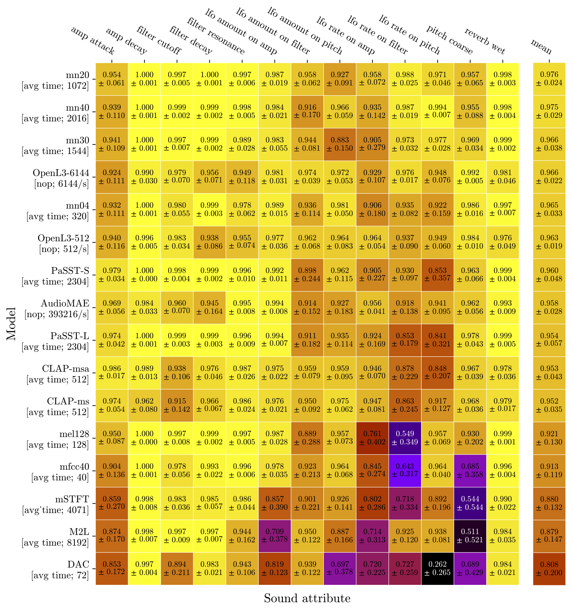

<h1 align="center">
  Neural Proxies for Sound Synthesizers: <br>
  Perceptually Informed Preset Representations
</h1>

<p align="center">
  Official repository for the audio model ranking evaluation presented in <br>
  <strong>"Neural Proxies for Sound Synthesizers: Learning Perceptually Informed Preset Representations"</strong><br>
  published in the <em>Journal of the Audio Engineering Society (JAES)</em>.
</p>

---

# Audio Model Ranking Evaluation

This repository contains the code for evaluating **pretrained audio models**. The evaluation is based on a ranking experiment designed to assess the perceptual relevance of audio embedding spaces, i.e., do embedding distances reflect monotonic changes in perceptual sound attributes?

The project's main repository can be found [here](https://github.com/pcmbs/synth-proxy).


## Experimental Design

### Dataset

The evaluation relies on a custom datasets based on the [TAL-NoiseMaker](https://tal-software.com/products/tal-noisemaker) synthesizer, and can be downloaded [here](https://e.pcloud.link/publink/show?code=kZHqPOZjX0KXS0Fcu0yDJagAWHOM5b9lWSy) and should be placed in the `data/` directory.

**Dataset description**:
* The dataset consists of 13 groups, each corresponding to a synthesizer parameter (e.g., amplitude envelope, filter cutoff, pitch).
* Each group contains 10 presets.
* For each preset, the associated parameter was monotonically increased in 20 steps.
* Bipolar parameters (centered around zero) were restricted so that all 20 values remained either above or below the midpoint.

### Evaluation procedure
For each sound attribute, the evaluation can be described as follows:
1. Extract representations from the audio model under evaluation.
2. Apply a [temporal reduction function](#temporal-reduction-functions) across time frames.
3. Compute pairwise **L1 distances** between presets.
4. Rank the sounds relative to the minimum and maximum parameter values.
5. Compute **Spearman rank correlation coefficients** for both rankings and average them.

### Models evaluated
Seven popular pretrained audio model families, plus hand-crafted baselines:
* [AudioMAE](https://github.com/facebookresearch/AudioMAE)
* [CLAP](https://github.com/LAION-AI/CLAP)
* [DAC](https://github.com/descriptinc/descript-audio-codec)
* [EfficientAT](https://github.com/fschmid56/EfficientAT) (uses `mn` prefix indicates MobileNetV3 backbone)
* [M2L](https://github.com/SonyCSLParis/music2latent)
* [OpenL3](https://github.com/torchopenl3/torchopenl3)
* [PaSST](https://github.com/kkoutini/PaSST)
* Baselines: (i) 128-bin Mel spectrogram (`mel128`); (ii) MFCCs of 40 bands (`mfcc40`); (iii) a multiresolution log-spectrogram (`mstft`).

→ EfficientAT and PaSST use a combination of **hand-crafted features** (time-averaged Mel-spectrograms) and **learned features**, while the other models rely only on learned features.

### Temporal reduction functions
* `nop`: Concatenate all frame-level representations.
* `avg time`: Average across timeframes → length-independent representation.
* CLAP produces already time-averaged embeddings.

---

## Results


## Usage
### Installation

```bash
git clone https://github.com/pcmbs/synth-proxy_audio-model-selection.git
cd synth-proxy_audio-model-selection
pip install -r requirements.txt
```

### Dataset
Download the custom [TAL-NoiseMaker](https://tal-software.com/products/tal-noisemaker) dataset [here](https://e.pcloud.link/publink/show?code=kZHqPOZjX0KXS0Fcu0yDJagAWHOM5b9lWSy). After downloading, place the dataset in the `data/` directory.

### Running evaluation

Example command (EfficientAT models only):

```bash
python src/eval.py -m model="glob(mn*,exclude=*_as)" distance_fn="glob(*)" reduce_fn="glob(*,exclude=identity)"
```
All models:
```bash
python src/eval.py -m model="glob(*,exclude=[clap_*,*0_as,*4_as])" distance_fn="glob(*)" reduce_fn="glob(*,exclude=identity)" ; python src/eval.py -m model="glob([clap_*,*0_as,*4_as])" distance_fn="glob(*)" reduce_fn="identity"
```

---

## Results
Results will be generated in the `logs/` directory, and can also be accessed via WandB.

## Citation
```bibtex
@article{combes2025neural, 
  author={combes  paolo and weinzierl  stefan and obermayer  klaus}, 
  journal={journal of the audio engineering society}, 
  title={neural proxies for sound synthesizers: learning perceptually informed preset representations}, 
  year={2025}, 
  volume={73}, 
  issue={9}, 
  pages={561-577}, 
  month={september},
} 
```
